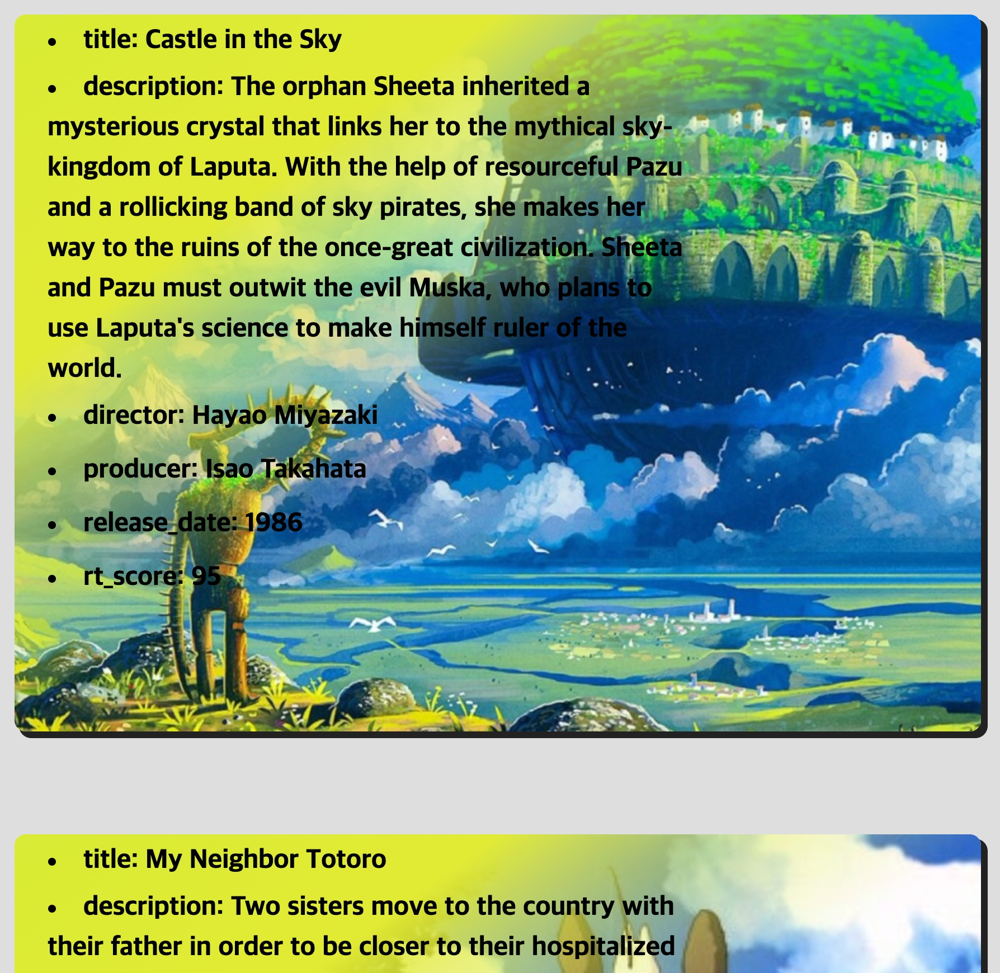
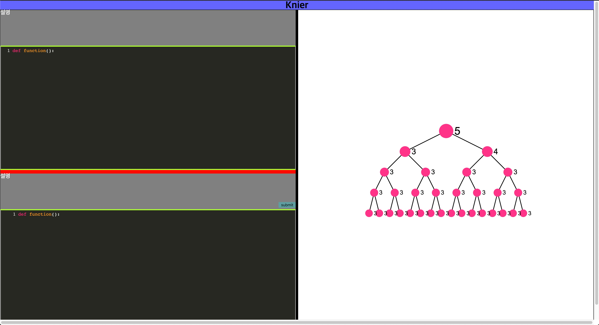
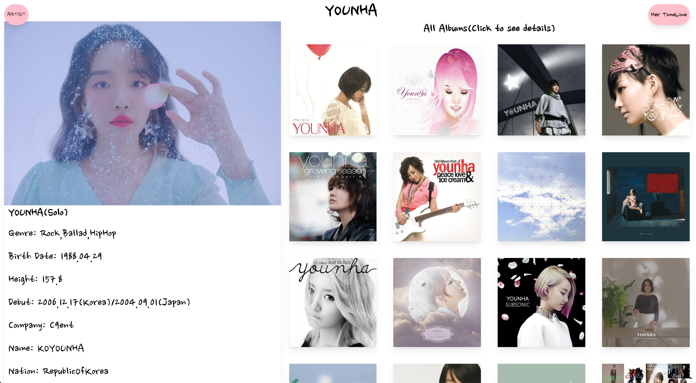

## First Work

> 

- Direct Url: https://minusmo.github.io/Ghibli-Movie-Showcase-/
- Github Repo: https://github.com/minusmo/Ghibli-Movie-Showcase-
- **Brief Introduction**  
  This is my first own project to show public. It's quite simple. This is made with **_html5, css3, vanillaJS_**. <u>_I made all the html elements dynamically that needs data from external API. Using vanillaJS, create elements, and put the data I want in the elements, and finally append it on the root element._</u>

---

## Second Work

> 

- Github Repo: https://github.com/minusmo/KnierTreeproject
- **Brief Introduction**  
  This is my second webapp project. I worked with a team named _Knier_. Our goal was to make a webapp which helps to render tree-structured data from a user input. <u>_Once a user put code about tree-structured algorithm in the code editor and submit it, client send the data to server. The server gets the data and transform it to json data. Finally send the json data to client and client renders tree-structured shape based on the data._</u>

---

## Third Work

> 

- Direct Url: https://musicapp.now.sh/
- Github Repo: https://github.com/minusmo/MusicApp

- **Brief Introduction**  
  This work is totally derived from my passion. I really love to listen to music. There are some korean artists whose songs I truely love and appreciate. Therefore I decided to make a web page for them so let many people know their songs live in countries without Republic of Korea. I used **_Next.js, React_** for frontend side, and **_express, mongodb_** for backend side. I deployed nextjs app via **_zeit now_**, and get my own data with **_axios_** on frontend side. The api endpoint is made myself, using **_mongodb atlas and json_** static file and deployed the api server on **_heroku_**.
